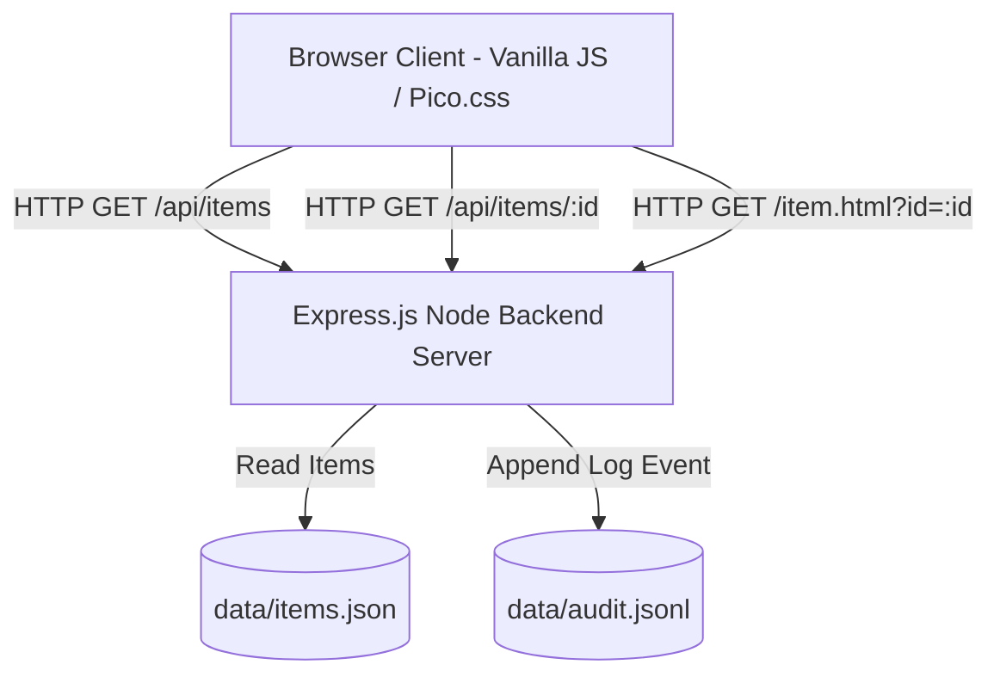

# System Architecture & Execution Traces

## 1. System Overview & Mermaid Diagram



---

## 2. Complete Call Stack & Execution Trace

### A. Project Level
- **Server Entry**: `src/server.js` listens on port `3000` (or `process.env.PORT`).
- **Static Assets**: Serves `public/` directory (HTML, CSS, JS).
- **API Router**: Mounts endpoints `/api/items`, `/api/items/:id`, `/api/audit-log`.

### B. Folder Level
- `src/`: Express backend modules (`server.js`, `audit.js`, `itemsRepository.js`).
- `public/`: Frontend assets (`index.html`, `item.html`, `app.js`, `item-detail.js`, `styles.css`).
- `data/`: Persistence files (`items.json`, `audit.jsonl`).

### C. File Level (Configuration & Environment Variables)
- Environment Variables: `PORT` (default: 3000), `NODE_ENV` (development/test/production).
- File Paths:
  - `ITEMS_FILE = path.join(__dirname, '../data/items.json')`
  - `AUDIT_FILE = path.join(__dirname, '../data/audit.jsonl')`

### D. Class & Module Level
- **`ItemsRepository`**:
  - `getAllItems(query)`: Reads `data/items.json`, filters by search/category, sorts by rank/name.
  - `getItemById(id)`: Returns matching item or `null`.
- **`AuditLogger`**:
  - `logEvent(eventType, payload)`: Appends structured JSON line to `data/audit.jsonl`.

### E. Method Level Call Stack (e.g. Fetching Item Details)

```
1. User clicks item card "LangGraph" on index.html
2. public/app.js -> navigateToItem("langgraph")
3. Browser performs HTTP GET /item.html?id=langgraph
4. public/item-detail.js -> DOMContentLoaded event listener fires
5. public/item-detail.js -> fetchItemDetail("langgraph")
6. HTTP GET /api/items/langgraph
7. Express Server -> Router -> GET /api/items/:id
8. Express Middleware -> AuditLogger.logEvent("API_GET_ITEM", { id: "langgraph" })
9. AuditLogger -> fs.appendFile("data/audit.jsonl", JSON.stringify({...}) + "\n")
10. Router -> ItemsRepository.getItemById("langgraph")
11. ItemsRepository -> JSON.parse(fs.readFileSync("data/items.json")) -> find item with id === "langgraph"
12. Server -> Responds HTTP 200 { id: "langgraph", title: "LangGraph", ... }
13. public/item-detail.js -> renderItemDetail(itemData)
14. DOM elements updated with Title, Description, Key Features, Use Cases, Specs, Documentation link.
```

### F. Variable Value Changes Trace (Execution Trace Example)

| Step | Location | Variable | Initial Value | Final Value |
|---|---|---|---|---|
| 1 | `app.js` | `searchTerm` | `""` | `"graph"` |
| 2 | `app.js` | `filteredItems` | `[10 items]` | `[1 item ("LangGraph")]` |
| 3 | `server.js` | `req.params.id` | `undefined` | `"langgraph"` |
| 4 | `itemsRepository.js` | `item` | `undefined` | `{ id: "langgraph", title: "LangGraph", category: "Framework", rank: 1 }` |
| 5 | `audit.js` | `logEntry` | `undefined` | `{"timestamp":"2026-03-30T12:00:00Z","event":"API_GET_ITEM","id":"langgraph"}` |
